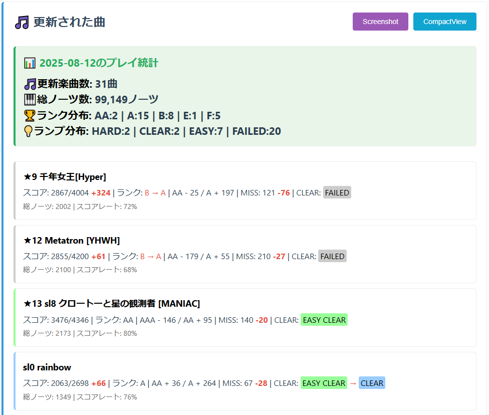
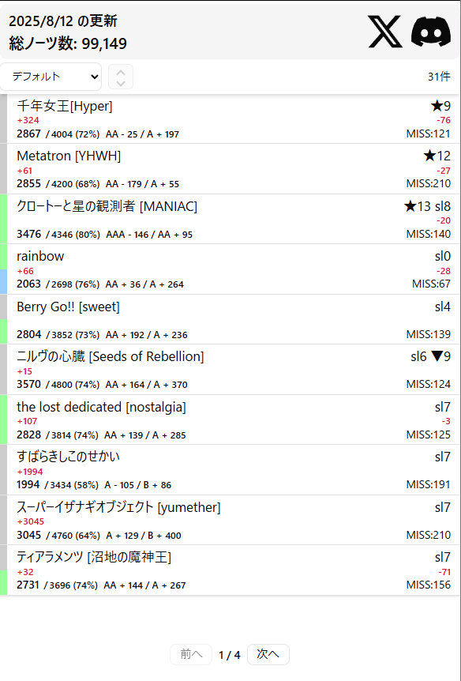
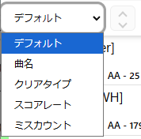
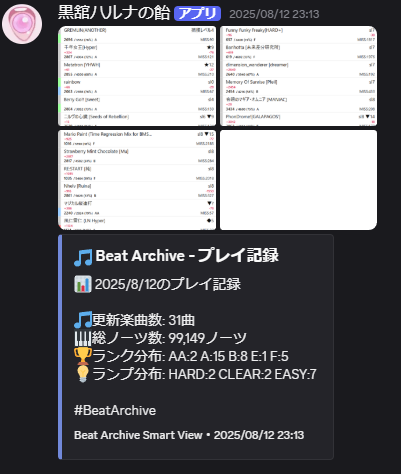
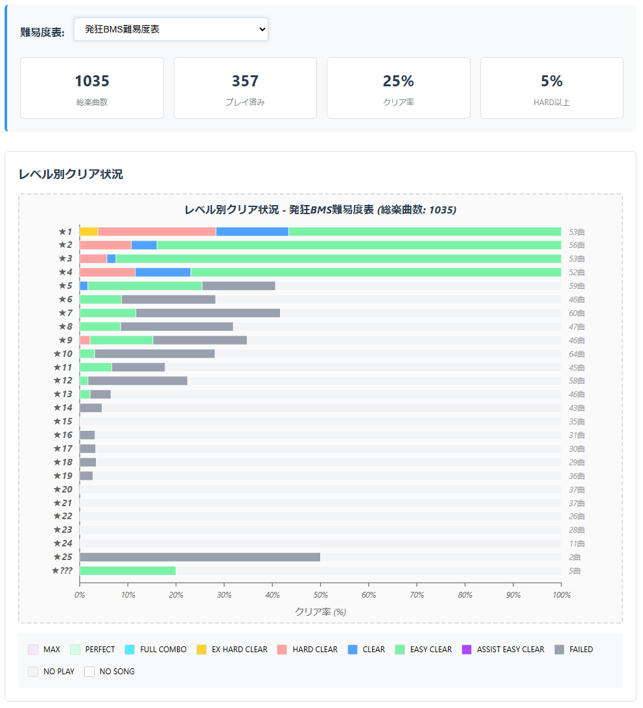
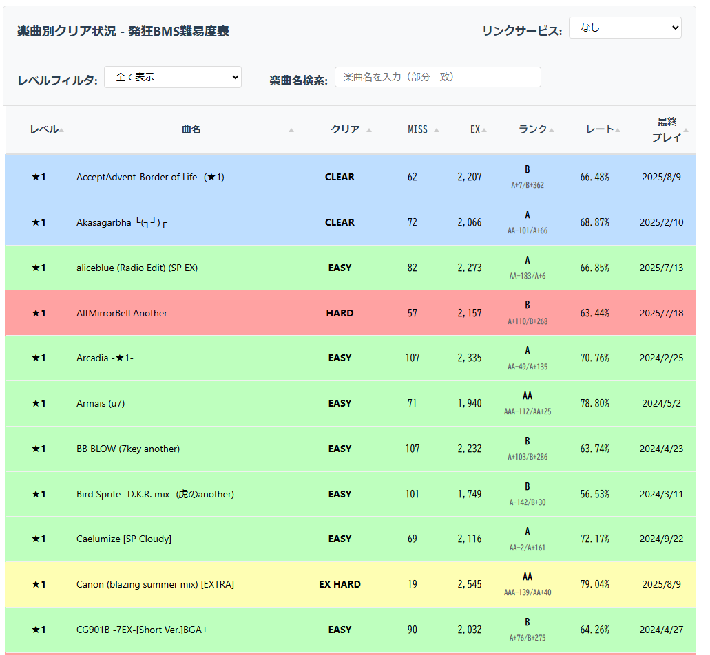
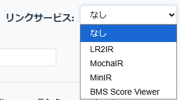

# Beat Archive

## Beat Archiveとは？

Beat Archiveは、BMSプレイヤーである**beatoraja**のスコアデータを総合的に管理・可視化するElectronベースのデスクトップアプリケーションです。プレイヤーのプレイ履歴、各種難易度表のごとのプレイ情報を閲覧することができます。  

## 主要機能

### 更新曲一覧

その日にランプを更新した曲、スコアが向上した曲、ミスカウントが減った曲を一覧表示します。  



### 共有画面 (Compact View)
情報量を絞った共有用のウィンドウ。  
XとDiscordでの共有が可能です。(Discord共有機能の使用には設定が必要です)


  
並び順の変更も可能です(昇順降順選択可)。  



その日のリザルトとしてCompactViewのスクリーンショットと統計情報をDiscordに送信することができます。  

### クリアランプ

難易度表ごとの楽曲クリア状況を視覚的に表示します。  

  


難易度ごとの詳細なデータを閲覧することも可能です。  

  


リンクサービスを設定することで、曲名から各種IR/譜面情報に遷移することができます。 
  
 
## 設定方法

### 初期設定

1. **beatorajaデータベースパス設定**
   
   beatorajaのPLayerフォルダを選択  
   score.db, scorelog.db, scoredatalog.db を自動で読み込みます。  
   songdata.db は手動で設定してください。  
   通常は beatoraja/songdata.db にあります  

2. **難易度表設定**
   ```
   設定 > 難易度表設定 > 使用する難易度表のURLを追加
   ```
   config.json もしくは config_sys.jsonからbeatorajaで使用している難易度表を一括で設定することもできます。  
   通常はbeatoraja/config_sys.json にあります。

3. **Discord連携設定**  
DiscordのWebhook URLを設定すると、Compact ViewからDiscordに統計情報を投稿できるようになります。
   ```
   1.Discord Webhook URLの取得方法  
   2.Discordサーバーの設定 → 連携サービス → ウェブフック
   3.「新しいウェブフック」をクリック
   4.チャンネルと名前を設定
   5.「ウェブフックURLをコピー」をクリック
   6.コピーしたURLを設定画面に貼り付け
   ```


### 対応環境

- **OS**: Windows 10/11 (64bit)
- **beatoraja**: 0.8.0以降

### データベースファイル

以下のbeatorajaデータベースファイルが必要です：

- `score.db` - スコアデータ
- `congif_sys.json` - beatorajaのconfigファイル
- `songdata.db` - 楽曲メタデータ  
- `scorelog.db` - プレイログ（オプション）
- `scoredatalog.db` - スコア変更ログ（オプション）


